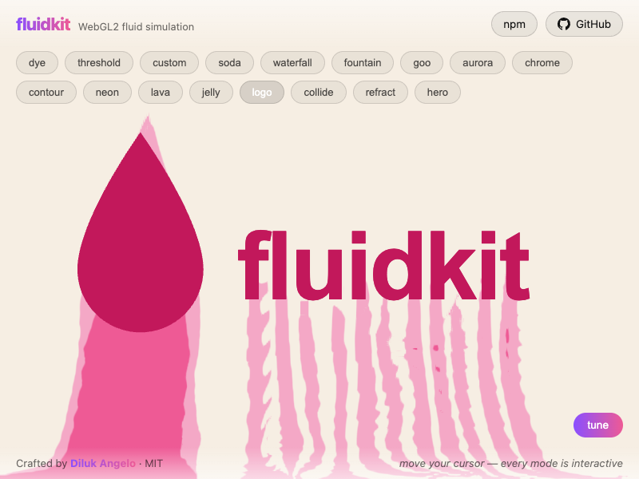
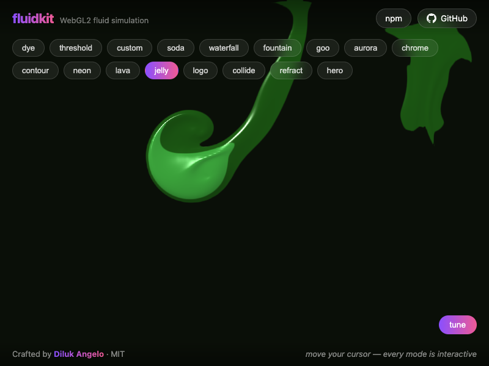
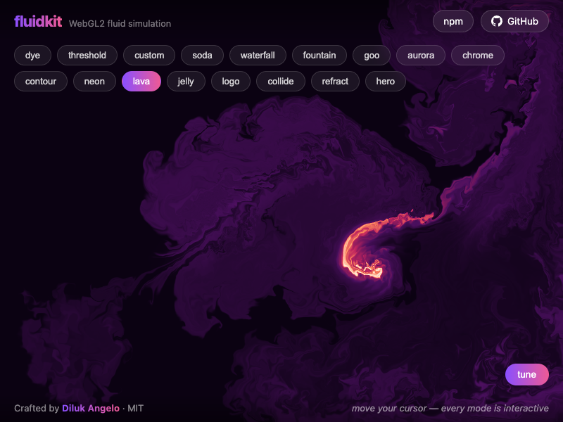
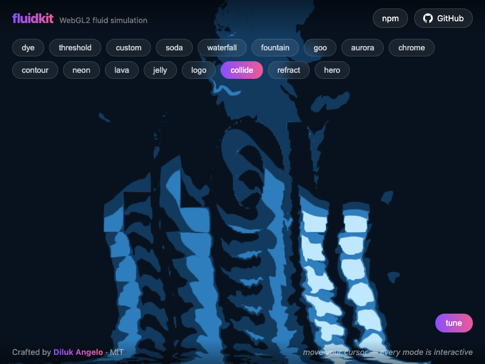
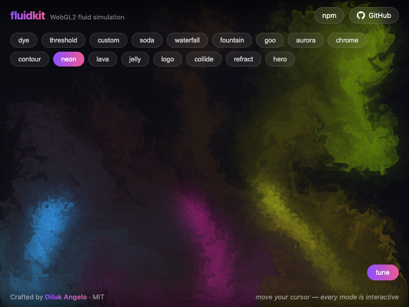
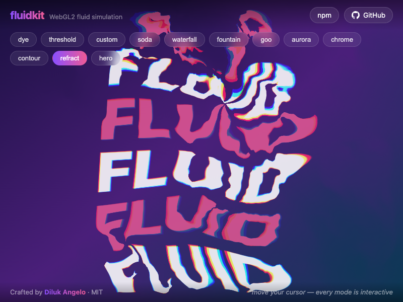

# fluidkit

**[Live demo →](https://fluidkit-chi.vercel.app/)** · [npm](https://www.npmjs.com/package/@dilukangelo/fluidkit)

|  |  |
|---|---|
|  |  |
|  |  |

Framework-agnostic GPU fluid simulation for the web. The sim engine (Stable Fluids on WebGL2)
produces velocity/dye field textures; pluggable render modes consume them — smoky dye, flat
posterized "sticker" liquid, or your own fragment shader.

**Status: v0.4** — WebGL2 backend; five render modes (`dye`, `threshold`, `ramp`,
`displacement`, `custom`); pointer, ambient, programmatic, mask, and audio emitters;
obstacles; React/Vue/Svelte adapters; CDN build. The WebGPU backend is the roadmap headline.

> **Building with an AI coding agent?** Point it at [AGENTS.md](./AGENTS.md) — a complete
> guide with landing-page recipes, the liquid-vs-smoke look formula, and pitfalls.

## Quickstart

```sh
npm install @dilukangelo/fluidkit
```

```ts
import { createFluid, threshold } from '@dilukangelo/fluidkit'

const fluid = createFluid(canvas, {
  emitters: { pointer: true, ambient: { strength: 0.2 } },
  render: threshold({
    levels: [{ cutoff: 0.1, color: '#ffc7ff' }],
    background: 'transparent',
  }),
})
```

That's it — interactive fluid on your canvas. Omit `render` for the classic smoky dye look.

## API

```ts
fluid.splat(x, y, dx, dy, { color: '#ffc7ff', radius: 0.25 }) // programmatic droplet, x/y in [0,1], y up
fluid.params.curl = 45                                        // all sim params live-tunable
fluid.setRenderMode(dye())                                    // swap looks at runtime
const tex = fluid.getTexture('dye')                           // raw WebGLTexture for three.js/pixi
fluid.pause(); fluid.resume(); fluid.destroy()
```

Sim params (all optional in `createFluid` options, all live-tunable via `fluid.params`):
`simResolution` (128), `dyeResolution` (1024), `curl` (30), `pressureIterations` (20),
`pressure` (0.8), `velocityDissipation` (0.2), `densityDissipation` (1.0),
`gravity` (0 — set 100–400 for pours/waterfalls), `wind` (0), `speed` (1),
`splatRadius` (0.25), `splatForce` (6000).

### Render modes

- `dye({ brightness, glow, glowRadius, background })` — classic smoky multicolor, with an
  optional neon halo.
- `threshold({ levels, background, outline, softness, lighting })` — up to 8 posterized
  levels with per-level alpha, edge AA, comic/sticker outline stroke, and wet-jelly
  lighting (gradient-derived normal + specular).
- `ramp(['#0b0212', '#c0245e', '#ffe8d6'])` — gradient-map: dye density drives a color ramp.
- `displacement({ source, strength, chromatic })` — the flow field distorts an image,
  canvas, or video with optional chromatic aberration (refraction/glass effects).
- `custom({ frag, uniforms })` — your GLSL ES 3.00 fragment shader; sample `uDye`, `uVelocity`,
  `uPressure`, use `uTime` and `texelSize`.

### Emitters

- `pointer: true | { color, intensity, radius, dragOnly }` — fixed color or palette per
  pointer, dye density, hover vs drag.
- `ambient: true | { strength, count, colors, radius }` — configurable autonomous wanderers.
- `fluid.setEmitterMask(textMask('your logo'), { color, strength })` — dye pours out of any
  text or image mask.
- `fluid.setObstacle(textMask('FLOW'))` — fluid flows *around* the mask; letters appear as
  negative space.
- `splat()` for anything programmatic, or the `onFrame(t, dt)` option to drive emitters
  without managing your own loop.

Sim extras: `gravity` (pours), `wind` (side drift), `speed` (slow motion / time scale) —
all live-tunable via `fluid.params`. `autoQuality` (on by default) halves dye resolution
under sustained frame overruns. `fluid.reset()` clears the fields; `fluid.screenshot()`
returns a PNG data URL; resizes preserve the fluid instead of flashing empty.

### Framework adapters & extras

```tsx
// React
import { FluidCanvas } from '@dilukangelo/fluidkit/react'
<FluidCanvas render={threshold({ ... })} onReady={f => f.splat(0.5, 0.5, 0, 400)} />
```
```html
<!-- Vue 3 -->
<FluidCanvas :options="{ render: ramp(['#000', '#f0f']) }" @ready="f => ..." />
<!-- import { FluidCanvas } from '@dilukangelo/fluidkit/vue' -->

<!-- Svelte (action, zero deps) -->
<canvas use:fluid={{ render: dye({ glow: 1 }), onReady: f => ... }} />
<!-- import { fluid } from '@dilukangelo/fluidkit/svelte' -->

<!-- Plain script tag / CodePen -->
<script src="https://unpkg.com/@dilukangelo/fluidkit/dist/fluidkit.iife.js"></script>
<script> fluidkit.createFluid(canvas, { render: fluidkit.dye({ glow: 1 }) }) </script>
```
```ts
// Sound-reactive: bass erupts from the bottom, treble sparkles on top
import { createAudioEmitter } from '@dilukangelo/fluidkit/audio'
const audio = await createAudioEmitter(fluid, { source: audioElement }) // omit source = microphone
```

`threshold({ bubbles: { density, rise, size } })` adds rising carbonation specks.
Masks accept videos or `live: true` canvases — an animated logo that pours while it moves.

### Behavior you get for free

- Pauses when the tab is hidden or the canvas scrolls off-viewport.
- Respects `prefers-reduced-motion` (opt out with `respectReducedMotion: false`).
- Recovers from WebGL context loss; resizes with the canvas; multiple instances per page;
  `destroy()` releases all GPU resources.
- SSR-safe: importing the package touches no browser globals.

## Examples

The [demo](https://fluidkit-chi.vercel.app/) ships twenty looks, all driven through the public API
(source in [`demo/main.ts`](./demo/main.ts) — each is a copy-paste starting point):

`dye` smoky multicolor · `threshold` posterized purple · `custom` ink-on-paper ·
`soda` pink liquid pour · `waterfall` raining streams · `fountain` rainbow jet ·
`goo` outlined metaball cursor · `aurora` hover-reveal · `chrome` liquid iridescence ·
`contour` living topographic map · `neon` glowing smoke · `lava` gradient-map ·
`smoke` gray plume in the wind · `fire` flame ramp · `fizz` carbonated seltzer ·
`jelly` lit slime · `logo` melting wordmark · `collide` flow around invisible text ·
`refract` image distortion · `hero` typography over fluid

Hit **tune** in the demo for live sliders over every sim param + copy-config.

## Develop

```sh
npm install
npm run dev    # live demo at localhost:5173 with mode switcher
npm test       # host-side unit tests (node 22.6+ / 24)
npm run build  # ESM + .d.ts to dist/
```

Requires WebGL2 with `EXT_color_buffer_float` (any non-ancient device).

MIT
